# IFC 4.3 中文版 - 自动同步系统使用指南

## 📚 概述

这个自动化系统可以从源代码仓库 `IFC4-3-x-development` 同步最新的文档更改到静态站点仓库 `IFC-4-3-Chinese`。

### 工作流程

```mermaid
graph LR
    A[源仓库 docs_zh] -->|检测更改| B[sync_from_source.py]
    B -->|调用渲染| C[Flask 服务器]
    C -->|生成 HTML| D[静态站点]
    D -->|Git 提交| E[GitHub]
    E -->|自动部署| F[Vercel]
```



### 核心组件

1. **源仓库**: `/Users/weilai/Documents/devs/IFC4-3-x-development`
   - `docs_zh/` - 中文 Markdown 文档
   - `code_zh/` - 渲染引擎（Flask server）

2. **目标仓库**: `/Users/weilai/Documents/devs/IFC-4-3-Chinese`
   - `IFC/RELEASE/IFC4x3/HTML/` - 静态 HTML 页面

3. **同步脚本**: `deployment/sync_from_source.py`

---

## 🚀 快速开始

### 基本用法

```bash
# 进入目标仓库
cd /Users/weilai/Documents/devs/IFC-4-3-Chinese

# 1. 检查待同步的更改
python3 deployment/sync_from_source.py --check

# 2. 同步单个文件
python3 deployment/sync_from_source.py --file /path/to/file.md

# 3. 同步所有检测到的更改（不自动提交）
python3 deployment/sync_from_source.py --sync --no-commit

# 4. 自动模式（检测 + 同步 + 提交 + 推送）
python3 deployment/sync_from_source.py --auto
```

---

## 📖 详细说明

### 命令选项

#### `--check` - 检查更改

检查源仓库中有哪些文件已修改，但不执行同步操作。

```bash
python3 deployment/sync_from_source.py --check
```

**输出示例**:
```
================================================================================
🔍 检查待同步的更改
================================================================================
🔍 检测源仓库中的更改...

📝 Git 未提交的更改 (3 个文件):
   - docs_zh/schemas/resource/IfcGeometryResource/Entities/IfcTrimmedCurve.md
   - docs_zh/schemas/core/IfcKernel/Entities/IfcRoot.md
   - docs_zh/concepts/Object_Definition/Property_Sets/content.md

🕒 最近 24 小时修改的文件 (15 个文件):
   - docs_zh/schemas/resource/IfcGeometryResource/Entities/IfcCircle.md (2025-10-09 14:30)
   ...
================================================================================
```

---

#### `--sync` - 同步更改

同步所有检测到的更改（Git 未提交的文件）。

```bash
# 同步但不自动提交
python3 deployment/sync_from_source.py --sync --no-commit

# 同步并自动提交每个文件
python3 deployment/sync_from_source.py --sync
```

**输出示例**:
```
================================================================================
🔄 同步更改到静态站点
================================================================================

📦 共 3 个文件待处理

📄 处理: docs_zh/schemas/resource/IfcGeometryResource/Entities/IfcTrimmedCurve.md
   URL: /IFC/RELEASE/IFC4x3/HTML/lexical/IfcTrimmedCurve.htm
✅ Flask 服务器已在运行
   🌐 请求渲染: http://127.0.0.1:5050/IFC/RELEASE/IFC4x3/HTML/lexical/IfcTrimmedCurve.htm
   ✅ 已保存: IFC/RELEASE/IFC4x3/HTML/lexical/IfcTrimmedCurve.htm (30.1 KB)
   ✅ 已提交到 Git

================================================================================
📊 同步完成: 成功 3 个，失败 0 个
================================================================================
```

---

#### `--file` - 同步单个文件

同步指定的单个文件，适合手动处理特定文件。

```bash
python3 deployment/sync_from_source.py \
  --file /Users/weilai/Documents/devs/IFC4-3-x-development/docs_zh/schemas/resource/IfcGeometryResource/Entities/IfcTrimmedCurve.md
```

**提示**: 可以配合 `--no-commit` 使用，避免立即提交。

---

#### `--auto` - 自动模式 ⚡

完全自动化的工作流程：检测 → 同步 → 提交 → 推送到 GitHub。

```bash
python3 deployment/sync_from_source.py --auto
```

**执行步骤**:
1. 检测源仓库中未提交的更改
2. 逐个渲染并保存到静态站点
3. 每个文件独立提交到 Git
4. 一次性推送所有提交到 GitHub
5. Vercel 自动触发重新部署

**适用场景**: 批量处理多个文件的更新

---

## 🛠️ 工作原理

### 文件路径映射

脚本自动将 Markdown 文件路径转换为 HTML URL 路径：

| Markdown 路径 | HTML URL |
|--------------|----------|
| `docs_zh/schemas/resource/IfcGeometryResource/Entities/IfcTrimmedCurve.md` | `/IFC/RELEASE/IFC4x3/HTML/lexical/IfcTrimmedCurve.htm` |
| `docs_zh/schemas/core/IfcKernel/Entities/IfcRoot.md` | `/IFC/RELEASE/IFC4x3/HTML/lexical/IfcRoot.htm` |
| `docs_zh/concepts/Object_Definition/Property_Sets/content.md` | `/IFC/RELEASE/IFC4x3/HTML/concepts/Object_Definition/Property_Sets/content.html` |

**映射规则**:
- `schemas/.../Entities/` → `lexical/`
- `schemas/.../Types/` → `lexical/`
- `concepts/` → `concepts/`（保留目录结构）

---

### Flask 服务器管理

脚本会自动检查和启动 Flask 渲染服务器：

1. **检查服务器**: 尝试连接 `http://127.0.0.1:5050`
2. **自动启动**: 如果服务器未运行，执行 `code_zh/start_zh_server.sh`
3. **等待就绪**: 最多等待 10 秒，确保服务器启动成功

**手动启动服务器**（可选）:
```bash
cd /Users/weilai/Documents/devs/IFC4-3-x-development/code_zh
./start_zh_server.sh
```

---

### Git 提交格式

自动提交时，使用以下提交信息格式：

```
feat: 同步渲染 IfcTrimmedCurve

源文件: docs_zh/schemas/resource/IfcGeometryResource/Entities/IfcTrimmedCurve.md
渲染时间: 2025-10-09 19:45:30

🤖 Generated with [Claude Code](https://claude.com/claude-code)

Co-Authored-By: Claude <noreply@anthropic.com>
```

---

## 📋 常见使用场景

### 场景 1: 修改了单个文件，立即更新

```bash
# 你刚编辑了 IfcTrimmedCurve.md
cd /Users/weilai/Documents/devs/IFC-4-3-Chinese

python3 deployment/sync_from_source.py \
  --file /Users/weilai/Documents/devs/IFC4-3-x-development/docs_zh/schemas/resource/IfcGeometryResource/Entities/IfcTrimmedCurve.md

# 手动提交和推送
git push origin main
```

---

### 场景 2: 批量同步多个文件

```bash
# 源仓库有多个文件修改
cd /Users/weilai/Documents/devs/IFC-4-3-Chinese

# 先检查有哪些更改
python3 deployment/sync_from_source.py --check

# 确认后，自动同步所有更改
python3 deployment/sync_from_source.py --auto
```

---

### 场景 3: 手动控制提交

```bash
# 同步但不自动提交
python3 deployment/sync_from_source.py --sync --no-commit

# 检查渲染结果
git status
git diff IFC/RELEASE/IFC4x3/HTML/lexical/IfcTrimmedCurve.htm

# 手动提交
git add .
git commit -m "feat: 批量更新实体定义页面"
git push origin main
```

---

### 场景 4: 定期自动同步（计划任务）

创建一个 cron 任务，每小时自动同步：

```bash
# 编辑 crontab
crontab -e

# 添加以下行（每小时执行一次）
0 * * * * cd /Users/weilai/Documents/devs/IFC-4-3-Chinese && python3 deployment/sync_from_source.py --auto >> /tmp/ifc_sync.log 2>&1
```

---

## ⚠️ 注意事项

### 1. Flask 服务器依赖

确保 Flask 服务器能正常运行：

```bash
cd /Users/weilai/Documents/devs/IFC4-3-x-development/code_zh

# 检查依赖
python3 -m pip install -r requirements.txt

# 手动测试服务器
python3 server.py
# 访问 http://127.0.0.1:5050 确认运行
```

---

### 2. Git 仓库状态

- **源仓库**: 脚本只检测 Git 未提交的更改，确保你在源仓库中编辑文件后不要立即提交
- **目标仓库**: 同步前确保工作目录干净，避免冲突

---

### 3. 网络和性能

- 渲染每个文件需要 1-5 秒
- 批量同步大量文件时可能需要较长时间
- 确保网络连接稳定（Flask 服务器在本地，但 Git 推送需要网络）

---

## 🐛 故障排除

### 问题 1: Flask 服务器启动失败

**症状**:
```
❌ Flask 服务器启动失败
```

**解决方案**:
```bash
# 检查服务器脚本
ls -l /Users/weilai/Documents/devs/IFC4-3-x-development/code_zh/start_zh_server.sh

# 手动启动服务器
cd /Users/weilai/Documents/devs/IFC4-3-x-development/code_zh
./start_zh_server.sh

# 检查服务器日志
tail -f server.log
```

---

### 问题 2: 文件路径映射失败

**症状**:
```
⚠️  文件不在 docs_zh 目录下: /path/to/file.md
```

**解决方案**:
- 确保文件路径在 `IFC4-3-x-development/docs_zh/` 目录下
- 检查文件路径是否正确

---

### 问题 3: 渲染失败 (HTTP 500)

**症状**:
```
❌ 渲染失败 (HTTP 500)
```

**解决方案**:
```bash
# 检查 Flask 服务器日志
cd /Users/weilai/Documents/devs/IFC4-3-x-development/code_zh
tail -f server.log

# 手动访问 URL 查看错误
curl http://127.0.0.1:5050/IFC/RELEASE/IFC4x3/HTML/lexical/IfcTrimmedCurve.htm
```

---

### 问题 4: Git 推送失败

**症状**:
```
❌ 推送失败: Permission denied
```

**解决方案**:
```bash
# 检查 Git 配置
git config --list

# 确保 SSH 密钥配置正确
ssh -T git@github.com

# 手动推送测试
git push origin main
```

---

## 📊 高级用法

### 自定义 Flask 服务器端口

如果需要更改服务器端口，编辑脚本中的配置：

```python
# deployment/sync_from_source.py
FLASK_SERVER_URL = "http://127.0.0.1:5050"  # 更改端口
```

---

### 仅同步特定类型的文件

修改脚本的 `get_modified_files_in_source()` 函数：

```python
# 例如：只同步 Entities 目录下的文件
if "/Entities/" in str(full_path):
    modified_files.append(full_path)
```

---

### 集成到 CI/CD 流程

可以在 GitHub Actions 中使用此脚本：

```yaml
# .github/workflows/sync.yml
name: Auto Sync from Source

on:
  schedule:
    - cron: '0 * * * *'  # 每小时执行

jobs:
  sync:
    runs-on: ubuntu-latest
    steps:
      - uses: actions/checkout@v3
      - name: Sync from source
        run: |
          python3 deployment/sync_from_source.py --auto
```

---

## 📚 相关文档

- [Flask 渲染引擎说明](../IFC4-3-x-development/code_zh/README.md)
- [文档编写指南](../IFC4-3-x-development/docs_zh/README.md)
- [Vercel 部署配置](../vercel.json)

---

## 🤝 贡献

如果你发现脚本有问题或需要改进，请：

1. 在 GitHub 上创建 Issue
2. 提交 Pull Request
3. 联系维护者

---

**最后更新**: 2025-10-09
**维护者**: Wei Lai
